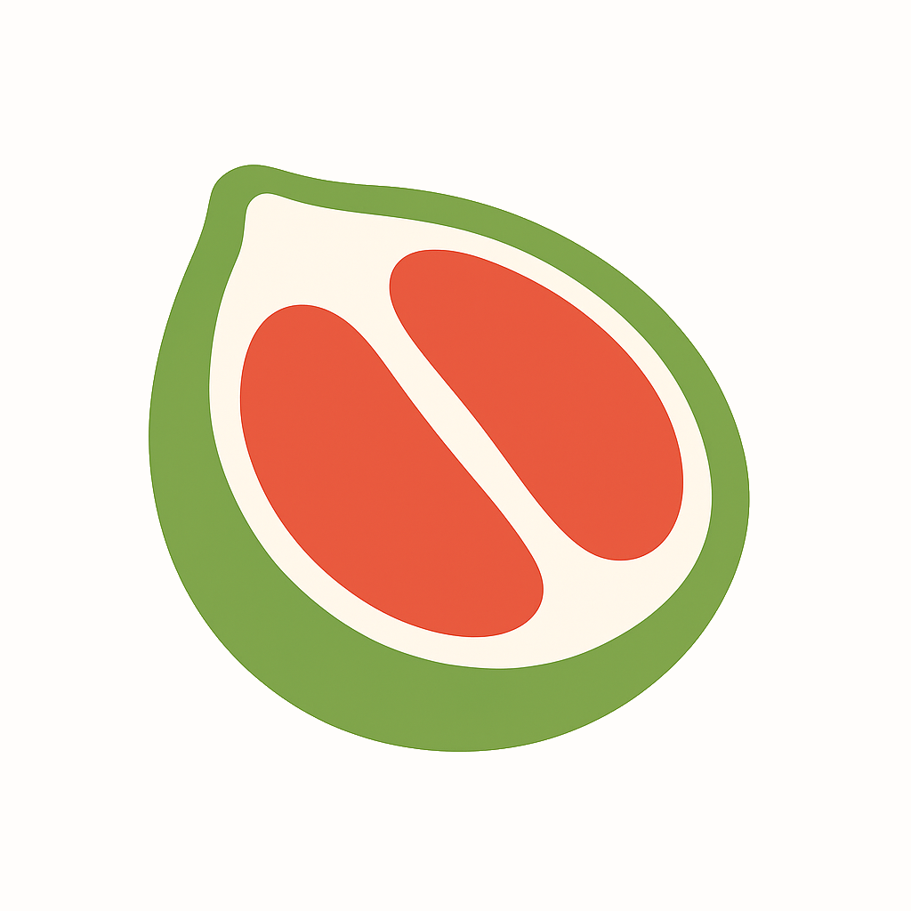

#  Pomelo - Анализ состава продуктов по фото

A Telegram bot for Max Hackathon that analyzes the composition of food products from photos and texts
using the free public API for food analysis.

Chat with the bot here:
https://max.ru/t48_hakaton_bot


### Prerequisites
Setup WSL 2 (for example Ubuntu) and install Docker. In setting select WSL 2 integration with Ubuntu.
WSL 2 + Docker setup guide: https://dev.to/kristarking/setting-up-docker-on-windows-with-wsl2-3cje

### Installation

1. Clone repository
```bash
git clone https://github.com/bolgaro4ka/pomelo-max-bot.git ./pomelo-max-bot
cd pomelo-max-bot
```

2. Copy `.env.example` to `.env` and fill in the necessary environment variables.
You can request secret keys from @ColorKat.

3. **Development mode (with hot reload):**
```bash
docker compose up --build
```

4. **Production mode:**
```bash
docker compose -f docker-compose.prod.yml up --build
```
